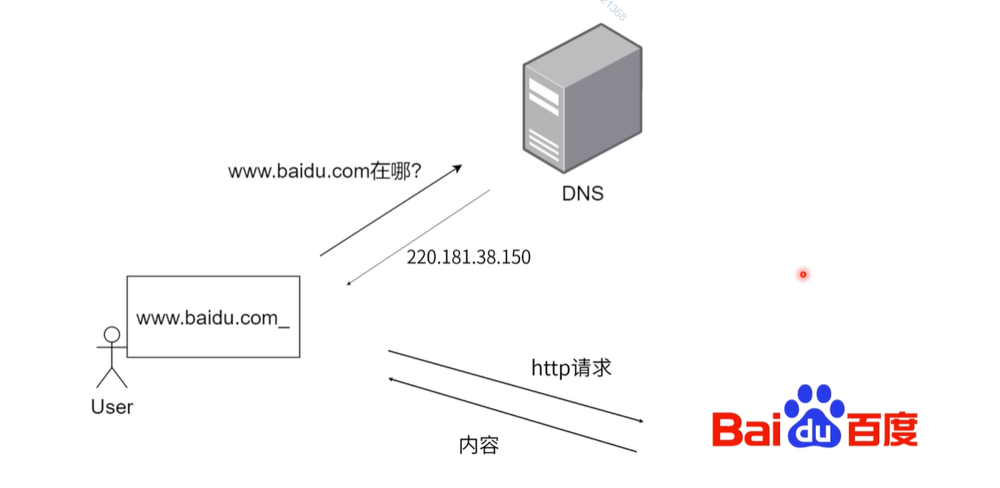
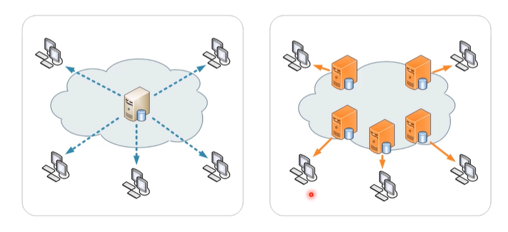
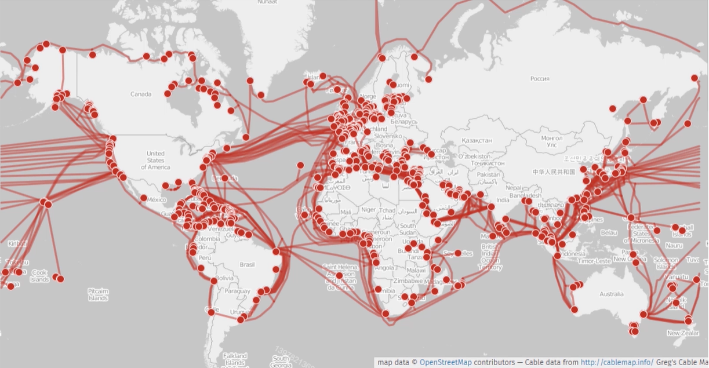
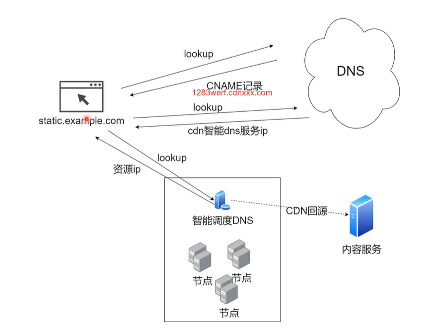

### 课程目标

+ 前端重点
+ 面试重点
+ 计网基础


### 课程内容

+ DNS的基础知识
+ DNS工具实战
+ CDN和CDN测试工具


## 01. DNS的基础知识

#### 统一资源定位符(URL)

也被称作**网址**，用于定位互联网上的资源


#### DNS(Domain  Name System)




#### DNS Query 过程


### DNS记录

+ 资源记录（Resource Record）
  - DNS 的数据库条目
+ 超过30种类型
  + 描述IP地址、别名等等


#### A记录

+ 定义主机的IP地址


#### AAAA记录

+ 定义主机的IPv6地址


#### CNAME记录（Canonical Name Record）

+ 定义域名的别名


#### MX记录（Mail exchanger record）

+ 定为邮件服务器


#### NS记录（Name Server Record）

+ 定义提供dns 信息的服务器（一般会有两个，防止一个挂掉之后，没有服务）


#### SOA记录（Start of Authority Record）

+ 定义在多个ns服务器中哪个是主服务器


#### TXT记录

+ 提供文本信息


## 02. DNS工具实战

### DNS查询工具（实操）

+ dig(DNS lookup utility)
  + 用来查询dns的小工具
+ nslookup
  + 交互式查询域名服务工具
+ host(DNS lookup utility)


#### 本地host修改（实操）

+ Window/linux/mac 等下host 文件修改
+ Switchhost工具

```shell
$ dig www.baidu.com
$ ping www.baidu.com
```


## 03. CDN

#### 内容分发网络（Content Delivery Network）

基于地理位置的分布式代理服务器/数据中心

+ 提供高可用
+ 提升性能
+ 提升体验




#### 世界互联网

沿海地区较多




#### 中国的主干网络

三大运营商

+ 中国联通
+ 中国电信
+ 中国移动

+ 中国教育和科研计算机网
+ 中国科技网
+ 广电带宽（2018）
+ ...


#### CDN实现原理



参考链接：https://developer.aliyun.com/article/243743

当用户输入一个网址，然后浏览器会检测这个网址上面所有资源的请求，比如拿一个js文件，

浏览器选发起一次关于该js的请求，先做DNS查询，去查询到这个js文件所在的 ip地址，

通过cdn服务会返回给一个CNAME 记录，

然后浏览器去查询这个 CNAME ，查到的是一个 cd智能dns 服务ip，

接着浏览器到了 cdn的这个 智能调度中心 DNS，

 然后调度中心知道你的域名之后你要请求这个js文件，会告诉你一个节点的 ip，这个节点的ip通常是离你比较近的。

另外还有一种情况，这个智能调度DNS没有这个js文件，会去那个有js文件的内容服务上门再拿一次js文件，这个过程叫做CDN回源。

cdn常用来存储变化不大的资源。


#### CDN云测工具（实操）

CDN云测工具实战演练

+ 站长之家 http://cdn.chinaz.com/
+ 17ce  https://www.17ce.com/


### 最后小结

+ DNS是个需要前端工程师理解的分布式系统（前后不分家、技多不压身）
+ DNS和CDN的缓存设计

